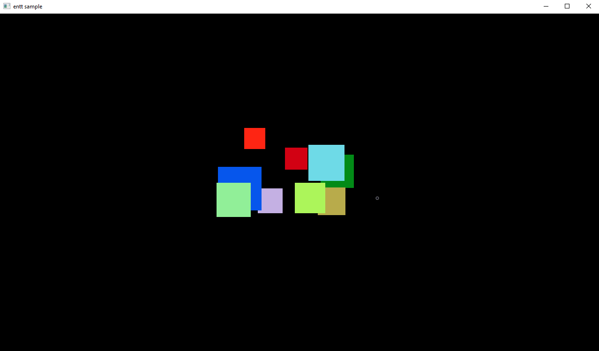

# entt-sample
entt sample using SDL for a renderer

Made this to learn how to use entt and to have a simple demo.

You need [conan](https://conan.io) and [premake](https://premake.io) to build this.

Using a terminal, go to the `Sample` folder and run `conan install .` followed by `premake GENERATOR_NAME` where `GENERATOR_NAME` is the name of your build system according to premake docs.

# Screenshots

